  

## 📌 About Me

- Currently attending engineering school
- Looking for project ideas
- Aspiring DevOps engineer

## 📊 GitHub Stats & Trophies

  
  

  

## 🛠️ Languages & Tools

> ## Programming Languages

       

> ## Frontend

      

> ## Backend

 

> ## Database

   

> ## DevOps & Cloud

 

> ## Tools

    

  

  

  

